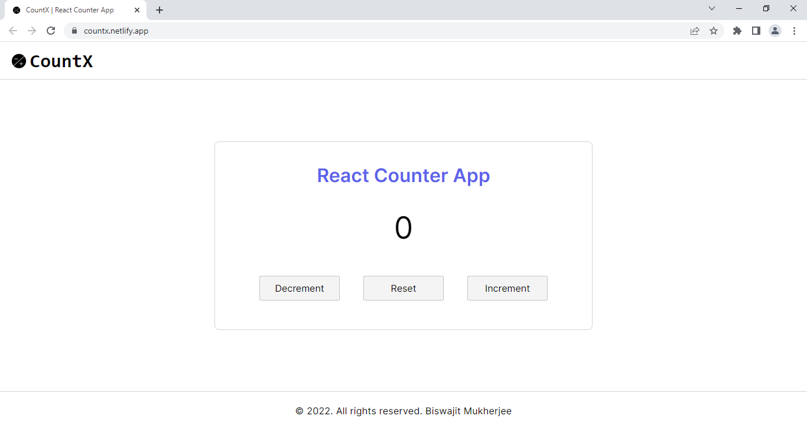

# Counts

A Counter app created using **create-react-app** template. Implemented an automatic CI/CD pipeline that pulls the latest code from **GitHub**, runs tests using **Jest** and **React-Testing-Library** and then deploys the successfull build to **Netlify** server.

**UI:** [React.js](https://reactjs.org/)

**CI/CD:** [Netlify](https://www.netlify.com/)

**Testing:** [Jest](https://jestjs.io/) and [React-testing-library](https://testing-library.com/docs/react-testing-library/intro/)

